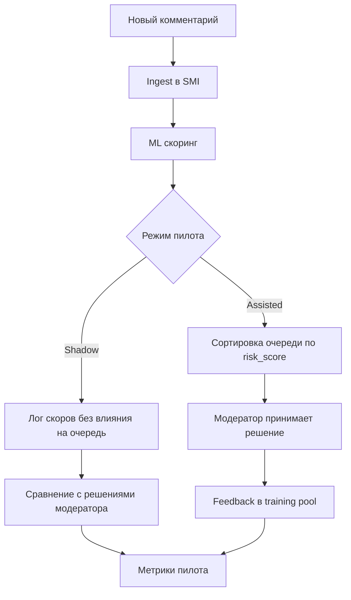
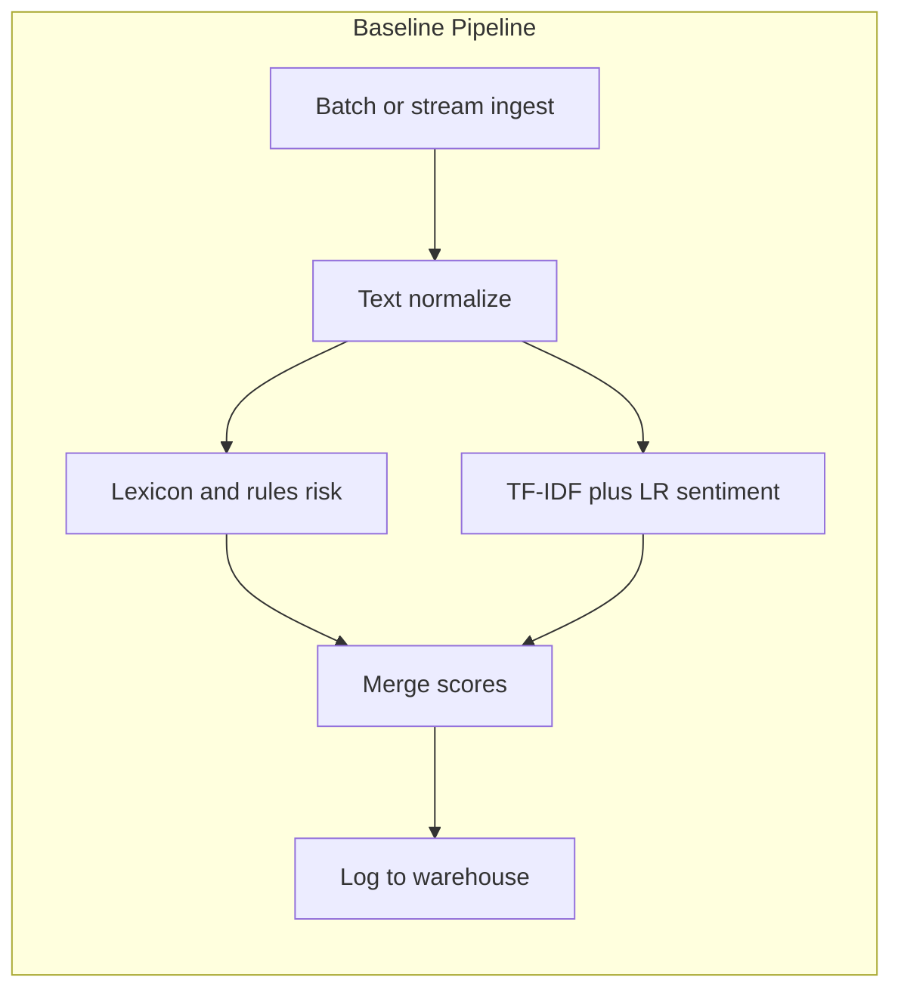
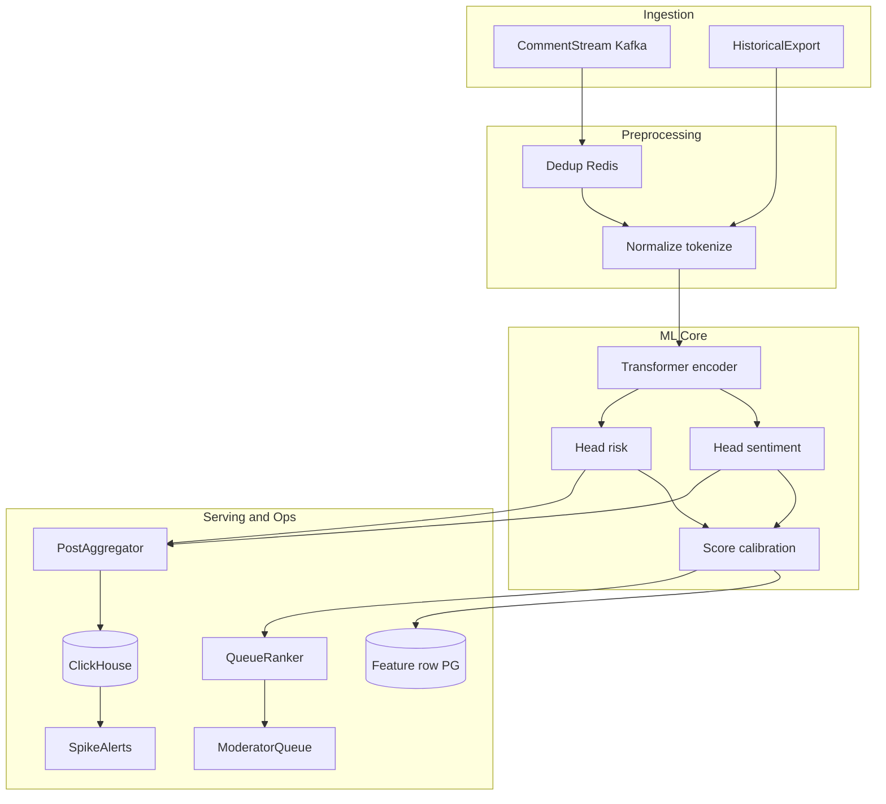
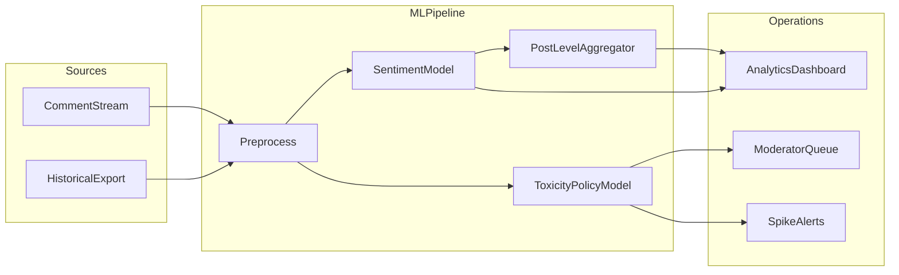
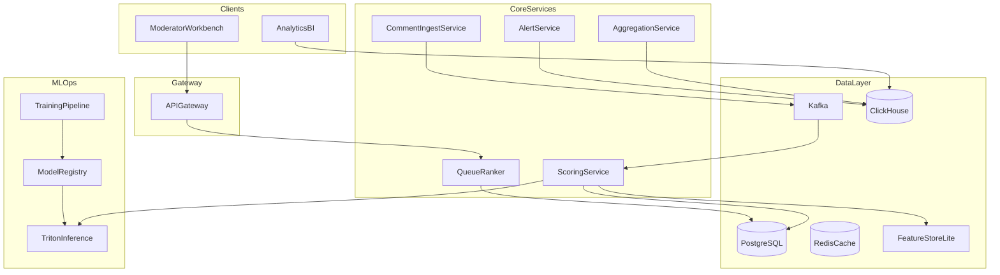

# ML System Design Doc - [RU]
## Дизайн ML системы — Sentiment & Moderation Intelligence (SMI) — MVP — 1

*Шаблон ML System Design Doc от телеграм-канала [Reliable ML](https://t.me/reliable_ml)*

- Шаблон и workflow Reliable ML — [репозиторий](https://github.com/IrinaGoloshchapova/ml_system_design_doc_ru)
- Контрольный список готовности — [checklist](https://github.com/IrinaGoloshchapova/ml_system_design_doc_ru/blob/main/checklist.md) (ИТМО & Reliable ML)

> ## Термины и пояснения
> - **Итерация** — все работы до старта очередного пилота
> - **БТ** — бизнес-требования
> - **EDA** — Exploratory Data Analysis
> - **SMI** — Sentiment & Moderation Intelligence (рабочее название продукта)
> - **РКН** — Роскомнадзор, контроль качества модерации ресурса
> - Роли: `Product Owner`, `Data Scientist` (в шаблоне совмещает DS + ML Engineer/MLOps)

---

## Оглавление

1. [Цели и предпосылки](#1-цели-и-предпосылки)
2. [Методология](#2-методология-data-scientist)
3. [Подготовка пилота](#3-подготовка-пилота)
4. [Внедрение (production)](#4-внедрение-для-production-системы)
5. [Приложение: контрольный список](#приложение-покрытие-контрольного-списка-reliable-ml--итмо)

---

### 1. Цели и предпосылки

#### 1.1. Зачем идем в разработку продукта?

**Бизнес-цель** (`Product Owner`)

Автоматизировать мониторинг пользовательских реакций на контент (посты, реклама, новости) в социальной сети: оперативно выявлять негатив и комментарии повышенного регуляторного риска, улучшать модерацию, повышать вовлечённость аудитории за счёт быстрой реакции на негативные волны.

**Почему станет лучше, чем сейчас, от использования ML** (`Product Owner` & `Data Scientist`)

| Сейчас | С ML (SMI) |
|--------|------------|
| Анализ тональности вручную по выборке или отсутствует | Скоринг **каждого** комментария, попадающего на модерацию |
| До **500 000** комментариев/день — физически непокрываемо вручную | Масштабируемый инференс с едиными правилами скоринга |
| Субъективность и задержка решений | Приоритизация очереди модератора по `risk_score` |
| Риск пропуска неприемлемого контента (штрафы РКН) | Повышенный **recall** на классах риска + audit trail |

**Что будем считать успехом итерации с точки зрения бизнеса** (`Product Owner`)

- Сокращение медианного времени до первой проверки комментария с `risk=high` на **≥30%** (после assisted-пилота vs контроль).
- Доля high-risk комментариев, просмотренных модератором в первые **15 минут**, выросла на согласованный с PO процент (целевое значение уточняется после baseline замеров).
- На «золотой» выборке: recall классов `review`/`block` **≥0,90** при precision **≥0,50** (MVP-модель).
- Нет роста числа регуляторных инцидентов/эскалаций относительно контрольной группы в пилоте.

---

#### 1.2. Бизнес-требования и ограничения

**Краткое описание БТ** (`Product Owner`)

| ID | Требование |
|----|------------|
| БТ-1 | Покрытие скорингом **100%** комментариев, поступающих на модерацию (не выборочный анализ) |
| БТ-2 | Классификация **тональности**: `negative` / `neutral` / `positive` |
| БТ-3 | Флаг **повышенного риска** для эскалации (оскорбления, угрозы, запрещённый контент — категории согласуются с Legal/Compliance и политикой модерации) |
| БТ-4 | **Агрегация** на уровне поста/кампании: доля негатива, скорость роста, топ-триггеры |
| БТ-5 | **Интеграция** с очередью модераторов (assistive moderation, не автобан в MVP) |
| БТ-6 | **Отчётность** и аудит решений для внутреннего контроля качества и взаимодействия с регулятором |

**Бизнес-ограничения** (`Product Owner`)

- Контекст РФ: мониторинг качества модерации со стороны **РКН** — высокая цена **false negative** по неприемлемому контенту.
- **152-ФЗ** / GDPR-подобные требования: минимизация PII в логах, сроки хранения, право субъекта на удаление.
- Язык контента: преимущественно **русский** (сленг, опечатки, обфускация мата).
- Бюджет на GPU-инференс и FTE DS/MLE/DE на итерацию.
- MVP **не заменяет** модератора — финальное решение остаётся за человеком.

**Функциональные требования (FR)**

| ID | Требование |
|----|------------|
| FR-1 | Near-real-time скоринг при публикации/попадании комментария в модерацию |
| FR-2 | Событие/API: `comment_id`, текст, `post_id`, timestamp, тип контента, флаг рекламы |
| FR-3 | Ранжирование очереди модератора по `risk_score` (desc) |
| FR-4 | Дашборд: тренд тональности по постам, алерты при spike негатива |
| FR-5 | Feedback loop: модератор переопределяет метку → данные для дообучения |
| FR-6 | Краткое объяснение для модератора (категория риска / топ-фразы) |

**Нефункциональные требования (NFR)**

| ID | Требование |
|----|------------|
| NFR-1 | Пропускная способность **≥500 000** комментариев/сутки (~6 RPS среднее, пики **100–150 RPS**, запас ×2) |
| NFR-2 | Latency p95 инференса **<300 ms** на комментарий (синхронный путь в очередь) |
| NFR-3 | Пересчёт агрегатов по посту: **1–5 мин** |
| NFR-4 | Доступность сервиса скоринга **99,9%**; RTO **<15 мин** |
| NFR-5 | Версионирование моделей и датасетов, воспроизводимость экспериментов |
| NFR-6 | Fallback при недоступности ML: rules-only + FIFO |

**Что ожидаем от конкретной итерации** (`Product Owner`)

- Рабочий **бейзлайн** (правила + LR) и **MVP-модель** (fine-tuned ruBERT-family).
- **Shadow-пилот** (2–4 нед.) и **assisted queue** (4–6 нед.) на части трафика.
- Интеграция с очередью модератора и базовым дашбордом.

**Описание бизнес-процесса пилота** (`Product Owner`)



1. **Shadow mode:** модель считает `sentiment` и `risk` параллельно; модераторы работают по текущему FIFO-процессу; еженедельно — отчёт согласованности с ручными метками.
2. **Assisted queue:** на 50% трафика (или выбранных разделах) очередь сортируется по ML; контрольная группа — FIFO.
3. При успехе — rollout на 100% трафика модерации.

**Что считаем успешным пилотом** — см. раздел [3.2](#32-что-считаем-успешным-пилотом).

**Возможные пути развития:** автоматическое скрытие очевидного spam/toxic с human review; мультимодальность; active learning; отдельные модели по типам контента (реклама vs новости).

---

#### 1.3. Что входит в скоуп проекта/итерации, что не входит

**На закрытие каких БТ подписываемся в данной итерации** (`Data Scientist`)

| БТ | Покрытие в итерации |
|----|---------------------|
| БТ-1, БТ-2, БТ-3 | Да (бейзлайн + MVP) |
| БТ-4 | Да (агрегаты 1h/24h, базовые алерты) |
| БТ-5 | Да (assisted queue) |
| БТ-6 | Частично (audit log + экспорт; полноценный compliance-отчёт — техдолг) |

**Что не будет закрыто** (`Data Scientist`)

- Полная замена модераторов; автобан без human review.
- Мультимодальность (изображения/видео в комментариях).
- Production-уровень сарказма/иронии.
- Active learning pipeline «из коробки».
- Multi-region, полноценная A/B-платформа, autoscaling K8s.
- Отдельная LLM для объяснений.

**Качество кода и воспроизводимость** (`Data Scientist`)

- Репозиторий: training/inference скрипты, Dockerfile, фиксация версий зависимостей.
- DVC или аналог для версий датасетов; MLflow/аналог для экспериментов и registry.
- CI: lint + unit-тесты препроцессинга и API-контрактов.

**Планируемый технический долг** (`Data Scientist`)

| Элемент | Отложено на |
|---------|-------------|
| Kubeflow/Airflow вместо cron-retrain | Production v2 |
| Полноценный Feature Store (Feast) | После пилота |
| Canary/shadow deploy в K8s | После стабилизации MVP |
| Fairness dashboard по сегментам | v2 |
| Triton dynamic batching tuning | Нагрузочное тестирование |

---

#### 1.4. Предпосылки решения

(`Data Scientist`)

| Предпосылка | Обоснование |
|-------------|-------------|
| Единица скоринга — **один комментарий** | Соответствует бизнес-процессу модерации |
| Агрегация: **пост × окно** (1h, 24h) | Аналитика вовлечённости и spike-алерты |
| Горизонт прогноза | Нет прогноза «на завтра» в MVP; онлайн-классификация + anomaly detection на агрегатах |
| Частота пересчёта модели | **Ежемесячное** дообучение; hotfix при дрейфе (PSI, падение recall) |
| Минимальный объём разметки | **50–100k** размеченных комментариев для MVP; **200k+** — целевой объём |
| Стабильный `comment_id` | Обязателен для feedback loop и аудита |

---

### 2. Методология `Data Scientist`

#### 2.1. Постановка задачи

С технической точки зрения решаем:

1. **Многоклассовая текстовая классификация** — тональность (`negative`, `neutral`, `positive`).
2. **Бинарная / многоклассовая классификация** — риск модерации (`ok`, `review`, `block` или бинарный `needs_review`).
3. **Ранжирование (LTR lite)** — сортировка очереди по калиброванному `risk_score`.
4. **Обнаружение аномалий** на временных рядах доли негатива по посту (z-score / EWMA в MVP; Prophet — опционально post-MVP).

**Не применяем:** рекомендательные системы, регрессию выручки, полнотекстовый поиск.

---

#### 2.2. Блок-схема решения

##### Бейзлайн



**Этапы:** ingest → нормализация (lower, unicode NFKC, замена повторов букв) → словари Legal (мат, угрозы) → TF-IDF + Logistic Regression (sentiment) → объединение `risk_rule` и `sentiment_ml` → запись в витрину для сравнения с MVP.

##### MVP (основной контур)



**Отличия MVP от бейзлайна:** потоковая обработка (Kafka), нейросетевая модель с multi-task heads, калибровка вероятностей, приоритизация очереди, агрегаты и алерты в реальном времени.

##### Общий контур продукта (end-to-end)



---

#### 2.3. Этапы решения задачи

##### Этап 1 — Подготовка данных

**Данные и сущности**

| Название данных | Есть в компании | Источник / витрина | Ресурс | Качество проверено |
|-----------------|-----------------|---------------------|--------|-------------------|
| Комментарии (текст, id, timestamps) | Да | `moderation.comments`, event bus `comment.created` | DE | Нет — EDA |
| Решения модераторов (label, action) | Да | `moderation.decisions` | DE, Legal | Критично — EDA |
| Метаданные поста (тип, реклама, автор) | Да | `content.posts` | DE | Нет — EDA |
| История действий пользователя | Частично | `users.profile` (минимум для bias-аудита) | DE | Нет |
| «Золотой» set для аудита | Создаётся | Stratified sample 5–10k | DS, QA | Да — после adjudication |
| Словари (мат, экстремизм) | Да | Legal-approved lists | DS, Legal | Да |

**Без чего нельзя решить задачу:**

- Размеченные комментарии с действиями модераторов (хотя бы частично).
- Поток или батч-экспорт **всех** комментариев на модерацию.
- Стабильный `comment_id` и связь с `post_id`.

**Результат этапа:** витрины `dm_comments_labeled`, `dm_comments_scoring_queue`; отчёт EDA (распределения классов, длина текста, дубликаты, шум меток).

| Аспект | Бейзлайн | MVP |
|--------|---------|-----|
| Объём train | 30–50k размеченных | 80–150k+ |
| Split | Time-based по неделям | То же + stratify по `content_type`, `risk_label` |
| Golden set | 3k, не в train | 5–10k, adjudicated |

---

##### Этап 2 — Подготовка прогнозных моделей

| Аспект | Бейзлайн | MVP |
|--------|---------|-----|
| Алгоритм | Rules + TF-IDF + Logistic Regression | Fine-tuned `rubert-tiny2` / `cointegrated/rubert-tiny2` multi-task |
| Целевые переменные | `sentiment_label`; `needs_review` (бинарный) | `sentiment_label`; `risk_label` {ok, review, block} |
| CV | 3-fold time-series CV | 5-fold time-series CV |
| Feature engineering | n-grams 1–2, длина, URL flag | CLS embedding + meta: длина, `is_ad`, hour_of_day |
| Частота пересчёта | Offline batch 1×/день для отчёта | Online + batch retrain 1×/месяц |

**Метрики качества и связь с бизнесом**

| ML-метрика | Цель бейзлайн | Цель MVP | Бизнес-смысл |
|------------|---------------|----------|--------------|
| Macro-F1 `sentiment` | ≥0,55 | ≥0,75 | Качество аналитики вовлечённости |
| Recall `review`+`block` | ≥0,70 (rules) | ≥0,90 @ P≥0,50 | Меньше пропусков для РКН |
| Precision `review`+`block` | — | ≥0,50 | Не перегрузить модераторов |
| PR-AUC risk | — | ≥0,85 | Качество ранжирования очереди |
| Cohen's κ vs модератор | ≥0,45 | ≥0,60 | Доверие к системе |
| Latency p95 | <100 ms (CPU) | <300 ms (GPU) | Скорость реакции |

**Риски этапа и план**

| Риск | Вероятность | Митигация |
|------|-------------|-----------|
| Дисбаланс классов (`block` <1%) | Высокая | class weights, focal loss, oversampling |
| Шум в метках модераторов | Средняя | обучение на `confirmed`; adjudication golden set |
| Обфускация мата (л@л) | Средняя | нормализация, augmentation, rules fallback |
| OOV / новый сленг | Средняя | ежемесячный retrain, мониторинг PSI |
| Bias по темам постов | Средняя | slice-метрики по `content_type` |

**Бизнес-проверка этапа:** PO + Lead модерации просматривают 200 случайных предсказаний MVP vs бейзлайн; согласование порога `risk_score` для очереди.

---

##### Этап 3 — Интерпретация (согласовано с заказчиком)

| Аспект | Бейзлайн | MVP |
|--------|---------|-----|
| Метод | Top n-grams по весам LR | Integrated gradients / SHAP на 500 примерах/неделю |
| UI | Категория rule match | Категория риска + подсветка фраз в UI модератора |

---

##### Этап 4 — Бизнес-правила и метрики качества

| Аспект | Бейзлайн | MVP |
|--------|---------|-----|
| Правила | Hard block по Legal-лексикону → `risk=block` независимо от ML | То же + override: ML `ok` + rule hit → `review` |
| Бизнес-метрика | Offline recall@top-1000 queue | Time-to-review, throughput, audit miss rate |

---

##### Этап 5 — Подготовка инференса

| Аспект | Бейзлайн | MVP |
|--------|---------|-----|
| Serving | Batch Python job | Triton / ONNX Runtime, 2 replicas |
| Batching | N/A | dynamic batch max 32, timeout 10 ms |
| Версионирование | Git tag | MLflow Registry → Triton model repo |

---

##### Этап 6 — Интеграция в бизнес-процесс

Подключение к очереди модератора, shadow → assisted → full rollout (раздел 3).

---

##### Этап 7 — Мониторинг и дообучение

- Дашборды: распределение скоров, latency, доля override модератором.
- Триггер retrain: PSI >0,2 на embedding features или recall ↓5 п.п. на golden set.
- Процедура замены модели: shadow 7 дней → canary 10% → 100%.

---

##### Этап 8 — Финальный отчёт для бизнеса

Отчёт по итогам пилота: primary/guardrail метрики, ROI (экономия FTE × ставка − infra), рекомендация rollout.

---

### 3. Подготовка пилота

#### 3.1. Способ оценки пилота

(`Product Owner`, `Data Scientist`, при наличии — AB Group)

| Фаза | Дизайн | Длительность |
|------|--------|--------------|
| **Shadow** | Модель пишет скоры в БД; очередь FIFO; сравнение с решениями модератора и golden set | 2–4 недели |
| **Quasi-A/B** | Treatment: ML-ranked queue; Control: FIFO. Рандомизация по `hash(post_id) mod 2` или по сменам модераторов | 4–6 недели |

**Offline-метрики (shadow):** confusion matrix, PR-кривые, calibration plot, ошибки по сегментам (`реклама` / `новости` / `UGC`).

**Online-метрики (quasi-A/B):**

- Primary: median time-to-first-review для `risk=high`.
- Secondary: comments reviewed per moderator-hour; post-hoc audit miss rate (экспертная выборка).
- Guardrail: precision risk; число эскалаций/инцидентов.

**Статистика:** power analysis на primary (α=0,05, power=0,8); минимум **2 недели** на ветку при текущем объёме трафика.

---

#### 3.2. Что считаем успешным пилотом

(`Product Owner`)

| Метрика | Тип | Порог успеха |
|---------|-----|--------------|
| Median time-to-first-review (`risk=high`) | Primary | ↓ **≥30%** vs control |
| Recall@top-500 queue vs random | Primary | **≥85%** high-risk в top-500 |
| Precision `review`+`block` | Guardrail | **≥0,50** |
| Audit miss rate (golden post-hoc) | Guardrail | Не выше control |
| Cohen's κ sentiment | Secondary | **≥0,60** |
| Moderator throughput | Secondary | ↑ **≥15%** без роста ошибок |
| Инциденты / эскалации РКН | Guardrail | Нет статистически значимого роста |

При невыполнении guardrail — откат к FIFO, разбор ошибок, донастройка порога или дообучение.

---

#### 3.3. Подготовка пилота

(`Data Scientist`)

**Оценка вычислительной сложности (бейзлайн):**

- 500k × ~200 токенов × TF-IDF + LR на CPU: **~2–4 часа** batch/сутки или **<10 ms**/комментарий online.
- GPU **не обязателен** для бейзлайна.

**Оценка (MVP inference):**

- `rubert-tiny` ~30–50 ms на GPU (T4) с batching; 2× GPU replica покрывают 150 RPS с запасом.
- Kafka: 3 broker managed, retention 7 дней.
- Storage: PostgreSQL (очередь + audit), ClickHouse (агрегаты).

**Ограничения пилота:**

- Максимум **2** версии модели одновременно (prod + shadow).
- Бюджет пилота (ориентир, Yandex Cloud / аналог):

| Ресурс | Спецификация | USD/мес (ориентир) |
|--------|--------------|---------------------|
| GPU inference | 1× T4 | 250–400 |
| App servers | 2× 4 vCPU, 16 GB | 150–200 |
| Kafka managed | 3 broker, small | 200–350 |
| PostgreSQL + ClickHouse | managed small | 150–300 |
| Monitoring | Grafana + Prometheus | 50–100 |
| **Итого** | | **800–1350** |

Точные цифры уточняются после выбора облака (§4.6).

---

### 4. Внедрение `для production системы`

#### 4.1. Архитектура решения



**Компоненты**

| Компонент | Назначение |
|-----------|------------|
| CommentIngestService | Приём событий `comment.created` / `comment.updated` |
| Kafka | Буфер, decoupling, replay при сбоях |
| ScoringService | Препроцессинг, вызов Triton, калибровка, запись скоров |
| Triton Inference Server | Serving ONNX/TorchScript, dynamic batching |
| QueueRanker | Сортировка очереди модератора по `risk_score` |
| AggregationService | Метрики по постам (окна 1h, 24h) |
| AlertService | Spike негатива → webhook / PagerDuty |
| PostgreSQL | Очередь, audit trail, feedback |
| ClickHouse | Аналитика, дашборды Metabase/Grafana |
| Redis | Dedup, кэш последних скоров по `comment_id` |
| ModelRegistry + TrainingPipeline | Версии моделей; cron/Airflow retrain |

**Integration points — API**

| Метод | Endpoint | Описание |
|-------|----------|----------|
| POST | `/v1/comments/score` | Синхронный скоринг (body: `comment_id`, `text`, `post_id`, meta) |
| GET | `/v1/posts/{post_id}/sentiment-summary` | Агрегаты тональности за окно |
| GET | `/v1/moderation/queue` | Очередь; query: `sort=risk_desc`, `limit`, `offset` |
| POST | `/v1/feedback` | Override метки модератором |
| GET | `/v1/health` | Healthcheck для LB |
| GET | `/v1/models/version` | Активная версия модели |

**Пример запроса `/v1/comments/score`:**

```json
{
  "comment_id": "c_123456",
  "post_id": "p_789",
  "text": "текст комментария",
  "created_at": "2026-05-28T12:00:00Z",
  "content_type": "ad",
  "is_ad": true
}
```

**Пример ответа:**

```json
{
  "comment_id": "c_123456",
  "sentiment": {"label": "negative", "proba": 0.82},
  "risk": {"label": "review", "score": 0.91, "rule_hits": ["profanity_lexicon"]},
  "model_version": "smi-risk-sentiment-v3.2.1",
  "latency_ms": 47
}
```

---

#### 4.2. Описание инфраструктуры и масштабируемости

**Выбранный вариант для MVP:** managed Kafka + **2–3 VM** с Docker Compose (или minimal K8s) + **1 GPU node** (Triton) + managed PostgreSQL и ClickHouse.

| Альтернатива | Плюсы | Минусы |
|--------------|-------|--------|
| Full K8s + Triton | Autoscaling, стандарт MLOps | Высокий ops overhead для малой команды |
| VM + Docker Compose | Быстрый старт, предсказуемость | Ручное масштабирование |
| Serverless (Lambda) | Низкий ops | Cold start, сложность 500k/день, лимиты timeout |

**Почему выбор лучше для MVP:** баланс time-to-market и покрытия 150 RPS; миграция на K8s — без смены контрактов API (техдолг).

**Масштабирование:**

- Горизонтально: реплики ScoringService за LB; партиции Kafka по `post_id`.
- Вертикально: вторая GPU-реплика Triton при устойчивом >80% утилизации GPU.
- Backpressure: при lag Kafka > N — sampling только для аналитики, очередь модерации — rules-only priority.

---

#### 4.3. Требования к работе системы

| Параметр | Значение | Комментарий |
|----------|----------|-------------|
| Объём | 500 000 комментариев/сутки | ~5,8 комментариев/с |
| Средний RPS | ~6 | 500k / 86400 |
| Пиковый RPS | 100–150 (запас до 300) | Вирусный пост |
| p50 latency score | <150 ms | |
| p95 latency score | <300 ms | FR-2 |
| p99 latency score | <500 ms | |
| Availability | 99,9% | ~8,76 ч простоя/год |
| RPO скоров | 1 ч | Replay из Kafka |
| RTO | 15 мин | Fallback rules-only |
| Retention Kafka | 7 дней | Replay / reprocessing |
| Retention audit PG | 12 мес | Compliance |

---

#### 4.4. Безопасность системы

- **AuthN/Z:** JWT/mTLS между сервисами; RBAC (модератор, аналитик, admin).
- **Сеть:** private subnet для Triton; API Gateway — единственная публичная точка.
- **Уязвимости:** rate limiting на `/score`; max length текста 4k символов; sanitization control-символов.
- **Supply chain:** сканирование Docker-образов; pinned dependencies.

---

#### 4.5. Безопасность данных

- Персональные данные в комментариях: хранение по политике 152-ФЗ; DPIA до пилота.
- Маскирование PII в логах приложения и MLflow.
- Право на удаление: каскадное удаление/анонимизация по `user_id` в PG и CH.
- Данные для обучения: только агрегированные экспорты с approval Legal; запрет на вывоз в публичные датасеты.

---

#### 4.6. Издержки

См. таблицу в [§3.3](#33-подготовка-пилота). При росте до 1M комментариев/день: +1 GPU replica, +1 Kafka partition tier, ориентир **+40%** к infra.

---

#### 4.5. Integration points (детализация)

| Источник | Потребитель | Протокол | Данные |
|----------|-------------|----------|--------|
| Social platform | CommentIngestService | Kafka Avro | `comment.created` |
| ScoringService | Triton | gRPC | tensor input |
| ScoringService | PostgreSQL | SQL | scores, queue state |
| AggregationService | ClickHouse | HTTP insert | post aggregates |
| ModeratorWorkbench | APIGateway | REST | queue, feedback |
| AlertService | Slack/PagerDuty | webhook | spike alerts |
| TrainingPipeline | Object Storage | S3 API | datasets, checkpoints |

---

#### 4.6. Риски

| Риск | Влияние | Митигация |
|------|---------|-----------|
| Вирусный пост → 10× трафик | Lag, timeout | Kafka backpressure, autoscale GPU, временный rules-only |
| Деградация модели (дрейф) | FN ↑, штрафы | PSI monitoring, shadow deploy, monthly retrain |
| SPOF Triton | Простой скоринга | 2 replicas, circuit breaker → rules |
| Юридическая ответственность за автобан | Высокое | Только assist + audit в MVP |
| Нехватка разметки | Низкое качество | active sampling для разметки; правила как safety net |
| Adversarial obfuscation | FN toxic | normalization + rules + периодический adversarial aug |

---

## Приложение: покрытие контрольного списка (Reliable ML / ИТМО)

Соответствие [контрольному списку](https://github.com/IrinaGoloshchapova/ml_system_design_doc_ru/blob/main/checklist.md) (ИТМО & Reliable ML):

| # | Пункт | Покрытие | Раздел документа |
|---|-------|----------|------------------|
| 1 | Бизнес-контекст задачи | Да | §1.1, кейс в заголовке |
| 2 | Бизнес-требования | Да | §1.2 (БТ-1…БТ-6) |
| 3 | Критерии успеха (бизнес-метрики) | Да | §1.1, §3.2 |
| 4 | Типичные сценарии использования | Да | §1.2 FR, §4.1 API, диаграмма пилота |
| 5 | Задача достижима в условиях и ресурсах | Да | §3.3 затраты, §1.3 scope |
| 6 | Постановка задачи ML | Да | §2.1 |
| 7 | ML-метрики, связь с бизнесом | Да | §2.3 этап 2, таблица метрик |
| 8 | Диаграмма архитектуры | Да | §2.2, §4.1 (mermaid) |
| 9 | Этапы решения | Да | §2.3 этапы 1–8 |
| 10 | Данные | Да | §2.3 этап 1, таблица |
| 11 | Инфраструктура | Да | §4.2 |
| 12 | Технические требования, нагрузка | Да | §4.3 |
| 13 | Требования к задержке | Да | §4.3 NFR |
| 14 | Надёжность (availability, RTO) | Да | §4.3, fallback §1.2 |
| 15 | Сценарии масштабирования | Да | §4.2 |
| 16 | Дообучение и замена модели | Да | §2.3 этап 7 |
| 17 | Bottlenecks | Да | §4.2 backpressure, §4.6 |
| 18 | Нагрузочное тестирование | Частично | Запланировано pre-rollout (§4.3); результаты — после реализации |
| 19 | Направления развития | Да | §1.2 пути развития |
| 20 | Форматирование, навигация | Да | Оглавление, структура по шаблону |
| 21 | Ревью команды | Pending | — |
| 22 | Опечатки | Проверено при создании | — |

**Статус:** 20/22 полностью покрыто; п. 18 (результаты load test) и п. 21 (ревью) — после реализации и согласования с командой.

---

*Документ подготовлен для итерации MVP продукта SMI. Версия: 1.0. Дата: 2026-05-28.*
